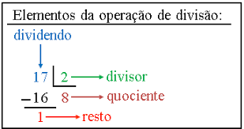

# Casos de teste

Para testar o correto funcionamento das nossas funções realizamos unit testing utilizando o módulo Test.HUnit. Estes unit tests encontram-se nos ficheiros FibTest.hs e BigNumberTest.hs. Ambos têm uma função runAllTests que corre todos os testes e mostra os resultados. Nota: Estes testes apenas correm em linux.

    ghci FibTest.hs
    *Main> runAllTests 
    Cases: 24  Tried: 24  Errors: 0  Failures: 0
    Counts {cases = 24, tried = 24, errors = 0, failures = 0}

    ghci BigNumberTest.hs
    *BigNumberTests> runAllTests
    Cases: 34  Tried: 34  Errors: 0  Failures: 0
    Counts {cases = 34, tried = 34, errors = 0, failures = 0}

# Pergunta 1

## 1.1 fibRec

Esta função calcula o número de Fibonacci de ordem i, recursivamente.

## 1.2 fibLista

Esta função calcula o número de Fibonacci de ordem i, utilizando uma lista de resultados parciais (função fibs).

### fibs

Esta função retorna uma lista tal que lista !! i contém o número de Fibonacci de ordem i.

## 1.3 fibListaInfinita

Esta função calcula o número de Fibonacci de ordem i, gerando uma lista infinita com os números de Fibonacci e retorna o elemento de ordem i.

# 2.1 Definição de BigNumber

Para a definição de BigNumber é utilizado um tipo de dados novo, Sign, que é Pos ou Neg, que nos permite saber se o BigNumber é positivo ou negativo. Um BigNumber tem também a lista dos seus dígitos, [Int], pelo que a sua declaração é a seguinte:

`data BigNumber = BigNumber Sign [Int] deriving (Show,Eq)` 
`data Sign = Pos | Neg deriving (Show,Eq)`

Para que seja possível comparar BigNumbers, tanto Sign como BigNumber derivam de Eq, e para podermos observar os seus valores, ambos derivam de show.

# 2.2 Scanner

## [scanner] - String para BigNumber
Esta função recebe uma string e retorna um BigNumber. A string de input é analisada de dois modos distintos:
1. Analisa o primeiro caracter para ver se é um sinal negativo '-' ou se é um digito. No caso de ser '-', o BigNumber terá Sign = Neg e no caso de ser um dígito o BigNumber terá Sign = Pos. Para isto utilizamos uma função auxiliar charToSign.
2. Analisa a string como um todo, ignorando o caracter '-', no caso de existir e guarda o valor absoluto do número na lista do BigNumber. Para tal, utilizamos uma função auxiliar stringToList.
Depois de obtermos o Sign e a lista de dígitos podemos retornar o BigNumber desejado.

## [charToSign]

Transforma char em Sign. Se o char for '-' é retornado Neg e se o char for um digito, é retornado Pos. Se o char não for '-' nem um digito, é retornado erro. 

## [stringToList]

Transforma string em [Int]. Se o primeiro caracter for '-', é ignorado. Caso contrário, e se não for um digito, é lançado o erro. Esta função percorre recursivamente a string enquanto o char atual for um dígito. Chegando ao fim, é retornada a lista dos dígitos do valor absoluto número de input.

# 2.3 Output 

## [output] - BigNumber para String
Esta função recebe um BigNumber e retorna uma string.
Para o fazer, utiliza duas funções auxiliar, signToString e listToString, e concatena os seus resultados.

## [signToString]

Esta função recebe Sign e, no caso de ser Pos retorna "" e no caso de ser Neg retorna "-".

## [listToString]

Esta função recebe uma lista de inteiros menores que 10 (dígitos) e junta-os numa string. 

# 2.4 Soma

## [sumLists] Soma de listas

Esta função soma as listas dos dígitos de dois BigNumber e funciona para números positivos. Para tal, recebe as listas em ordem inversa.
A função é recursiva e vai somando os elementos "head" de cada lista e, se necessário, adiciona o overflow ao elemento seguinte e continua a somar até cada lista ter apenas um elemento cada (caso base da recursividade), caso onde é calculada a soma dos elementos e, caso necessário, é adicionado o overflow ao resultado.

## [somaBN] Soma de BigNumbers

Esta função recebe dois BigNumber e retorna a sua soma em BigNumber. No caso de dois números positivos ou dois números negativos, chama a função auxiliar sumLists. No caso de números de sinais diferentes, é chamada a função auxiliar subLists.

# 2.5 Subtração

## [subLists] Subtração de listas

Esta função recebe duas listas de dígitos e subtrai a segunda lista de dígitos à primeira. Esta função assume que ambos o valores são positivos e que a primeira lista representa um valor maior que a segunda.
A função é recursiva e vai subtraindo os elementos "head" de cada lista e, se necessário, modifica elemento seguinte conformo o overflow e continua a subtrair até cada lista ter apenas um elemento cada (caso base da recursividade), caso onde é calculada a subtração dos elementos.

## [subBN] Subtração de BigNumbers

Esta função transforma uma subtração numa soma, alterando o sinal do segundo BigNumber e chama a função somaBN.

# 2.6 Multiplicação

## [mulLA] Multiplicação entre uma lista e um algarismo

Recebe uma lista de inteiros, um inteiro menor que 10 e outro inteiro que representa o overflow da multiplicação.
A função é recursiva, e só para quando o primeiro algumento for uma lista vazia.

## [mulList] Multiplicação de duas listas

Recebe duas listas de inteiros e retorna o resultado da multiplicação destas duas listas também numa lista de inteiros.

A estratégia usada é semelhante ao algoritmo que se aprende na primária.
Recursivamente, vamos somar os resultados da multiplicação do primeiro valor, lista xs, com cada algarismo do segundo valor.

## [mulBN] Multiplicação com BigNumbers

Para o cálculo final será apenas necessário chamar a função mulList e calcular o sinal do resultado, que será positivo se os sinais forem iguais e negativo se forem diferentes.

# 2.7 Divisão

## [divSmallList] Divisão com subtrações repetitivas

Esta função recebe o divisor e dividendo, e, recursivamente, vai subtrair ao dividendo o divisor até que o primeiro seja maior que o segundo.
A cada chamada recursiva, incrementamos o terceiro argumento, que serve como contador, e, no final, será igual ao quociente

É importante referir que esta função é pouco eficiente, e é apenas utilizada como auxiliar da função principal

## [divList] Divisão de duas listas

A estratégia da divisão é baseada no seguinte esquema: 

Começa-se por utilizar uma lista com os primeiros algarismos do dividendo. Esta lista terá que ser maior que o divisor. Para fazer esta verificação é utilizada a função divSmallList, que retorna o nosso primeiro quociente.

De seguida, calcula-se o resto desta primeira divisão, e este resto passa a ser o nosso próximo dividendo.

O cálculo vai ser feito de forma recursiva, e a função acaba quando o dividendo for menor que o divisor.

## [calcReminder] Cálculo do resto

Recebe o divisor, dividendo e quociente e retorna o resto.

## [divBN] Divisão com BigNumbers

Para o cálculo final é chamada a função divList e calculado o sinal do resultado da mesma forma que na divisão
O resto é calculado com a função calcReminder.

# Funções auxiliares 
## [biggerAbsList]

As listas representa números inteiros não negativos. A função retorna True se o primeiro número for maior que o segundo e False no caso contrário.

## [removeLeftZeros]

Remove zeros à esquerda, mas se o número for 0, este é mantido.

Exemplos
- [0,0,7] -> [7] 
- [0,0,0] -> [0] 

## [equalList]

Retorna 'True' se duas listas tiverem o mesmo valor.

# Resposta à pergunta 3

## fibRecBN

Esta função calcula o número de Fibonacci de ordem i, recursivamente e à semelhança de fibRec, usando as funções somaBN e subBN.

## fibListaBN

Esta função calcula o número de Fibonacci de ordem i, utilizando uma lista de resultados parciais (função fibsBN).

### fibsBN

Esta função retorna uma lista tal que lista !! i contém o BigNumber de Fibonacci de ordem i. Esta função utiliza zipWith com a função somaBN.

## fibListaInfinitaBN

Esta função calcula o número de Fibonacci de ordem i, gerando uma lista infinita com os números de Fibonacci e retorna o elemento de ordem i. A lista infinita é gerada usando zipWith com a função somaBN

# Resposta à pergunta 4

As funções para calcular números de Fibonacci, usando (Int -> Int) são limitadas pelo número máximo que cabe em 64 bits pois Int's são guardados com precisão fixa. Por outro lado, ao usar (Integer -> Integer), como Integer é guardado com precisão arbitrária, o valor máximo é apenas limitado pela memória do computador. O mesmo acontece usando BigNumber, o valor máximo é apenas limitado pela memória do computador. 

Independentemente do tipo usado, Int, Integer ou BigNumber, a velocidade do calculo de números de Fibonacci é sempre limitada pelo processador.

Para Integral's podemos perceber que, usando a opção :set +s do ghci, o calculo é muito mais rápido e ocupa muito menos memória usando a função fibListaInfinita. Isto acontece porque a função fibRec é ineficiente por ser recursiva e fazer cálculos repetidos. A função fibLista, ao chamar a função recursiva fibs (para obter a lista com números de Fibonacci), está a alocar memória por cada chamada a fibs. Em contraste às funções anteriores, a função fibListaInfinita é eficiente em termos de tempo de execução e de memória utilizada.

    *Fib> :set +s
    *Fib> fibRec 30
    832040
    (4.53 secs, 1,750,889,192 bytes)  
    *Fib> fibLista 30
    832040
    (5.53 secs, 1,729,716,248 bytes)
    *Fib> fibListaInfinita 30
    832040
    (0.01 secs, 72,456 bytes)

Podemos fazer a mesma análise quando usamos BigNumber's. O cálculo usando a função recursiva fibRecBN é bastante demorado e custoso em termos de memória. Por outro lado, as funções fibListaBN e fibListaInfinitaBN são de eficiência comparável para números pequenos, tanto em termos de tempo de execução como em memória necessária. Para números maiores podemos verificar que a função fibListaInfinitaBN demora menos de metade do tempo que a fibListaBN demora.

    *Fib> :set +s
    *Fib> fibRecBN (scanner"30")
    BigNumber Pos [8,3,2,0,4,0]
    (22.66 secs, 7,899,762,224 bytes)
    *Fib> fibListaBN (scanner"30")
    BigNumber Pos [8,3,2,0,4,0]
    (0.08 secs, 91,632 bytes)
    *Fib> fibListaInfinitaBN (scanner"30")
    BigNumber Pos [8,3,2,0,4,0]
    (0.01 secs, 165,984 bytes)

    *Fib> fibListaBN (scanner"10000")
    ...
    (94.91 secs, 8,027,967,544 bytes)
    *Fib> fibListaInfinitaBN (scanner"10000")
    ...
    (40.28 secs, 8,028,041,896 bytes)

# Resposta à pergunta 5

## safeDivBN

Esta função previne as divisões por zero.
Assim,compara a lista do divisor com uma lista com um 0, utilizando a função equalList, e, caso se verifique que é igual a zero, retorna 'Nothing'. Caso contrário, realiza a divisão normalmente, chamando a dunção divBN.
